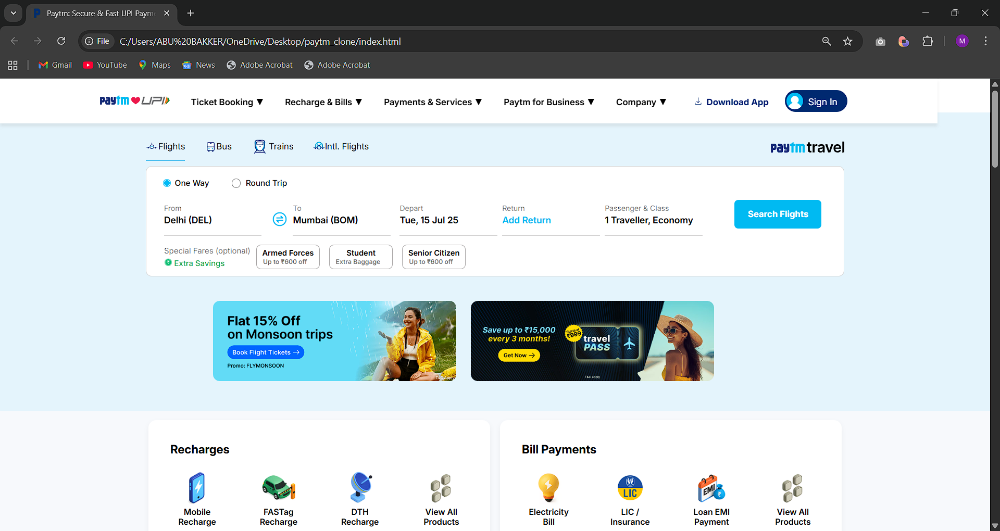

# Paytm Clone 🚀

A pixel-perfect front-end clone of the Paytm website as it appeared in June-July 2025. This project was developed as an internship assignment and is built entirely with **HTML5** and **CSS3** to replicate the user interface and layout of the platform.



---

## 📖 About The Project

This project is a static replica of the Paytm homepage, focusing on visual accuracy and structural fidelity. It was created to demonstrate proficiency in core front-end web technologies by cloning a complex, real-world website. The clone captures the design, layout, and responsiveness of the various components on the page.

---

## ✨ Features

This static clone includes the following key sections from the original website:
- **✈️ Travel Booking:** A complete UI for searching flights, buses, and trains.
- **📱 Recharges & Bill Payments:** Sections for:
  - Mobile, FASTag, & DTH Recharges
  - Electricity, Insurance, & Loan EMI Payments
- **💸 UPI & Bank Transfers:** A component showcasing the "Pay anyone directly from your bank account" feature.
- **💹 Paytm Money:** An overview of the investment and wealth management services.
- **💳 Credit Cards:** A dedicated section for partner credit card offerings.
- **🛡️ Insurance:** A module for discovering and purchasing insurance policies.
- **🏢 Paytm for Business:** A section detailing solutions for merchants.
- **Footer:** A comprehensive footer with navigation links and social media icons.

---

## 🛠️ Built With

This project was built using fundamental web technologies, with no frameworks or libraries.

*   
*   

---

## 🚀 Getting Started

To get a local copy up and running, simply follow these steps.

1.  Clone the repository:
    ```
    git clone https://github.com/your-username/paytm-clone.git
    ```
2.  Navigate to the project directory:
    ```
    cd paytm-clone
    ```
3.  Open the `index.html` file in your preferred web browser.

---

## ✍️ Author

**Mohammed Abubakker Siddiqui**

-   **LinkedIn:** (https://www.linkedin.com/in/md-abubakker-siddiqui/)
-   **Email:** mh.abubakker7@gmail.com

---

## 🙏 Acknowledgments

*   Special thanks to the mentorship team at GyaanKool Research Labs for the opportunity and guidance during the internship.
*   The project is inspired by the excellent design and user experience of the official Paytm website.

```
